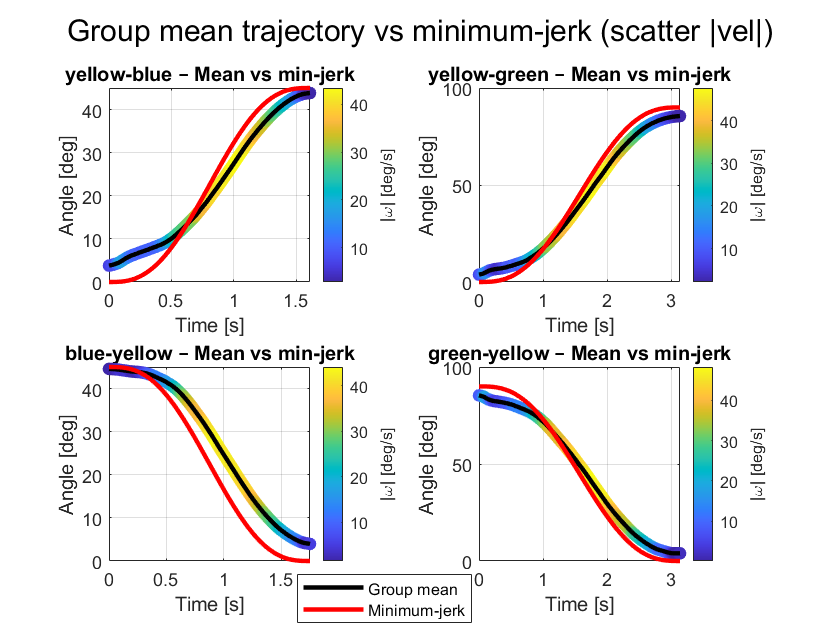
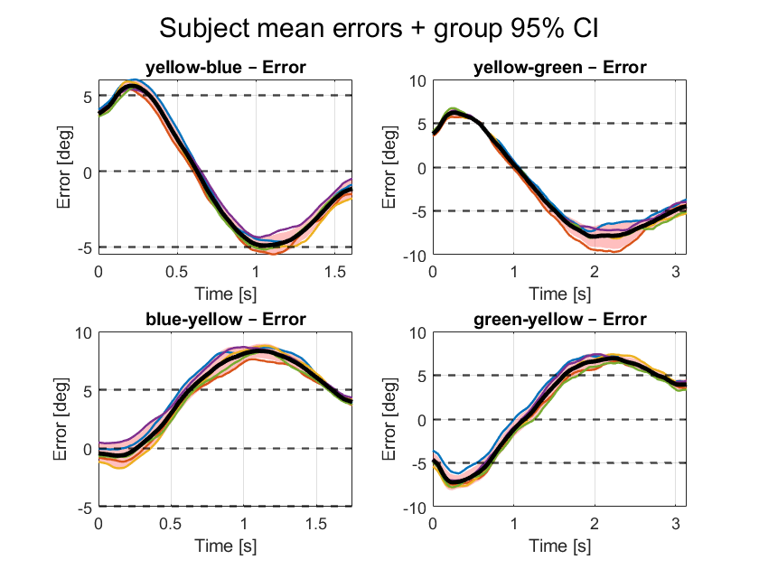
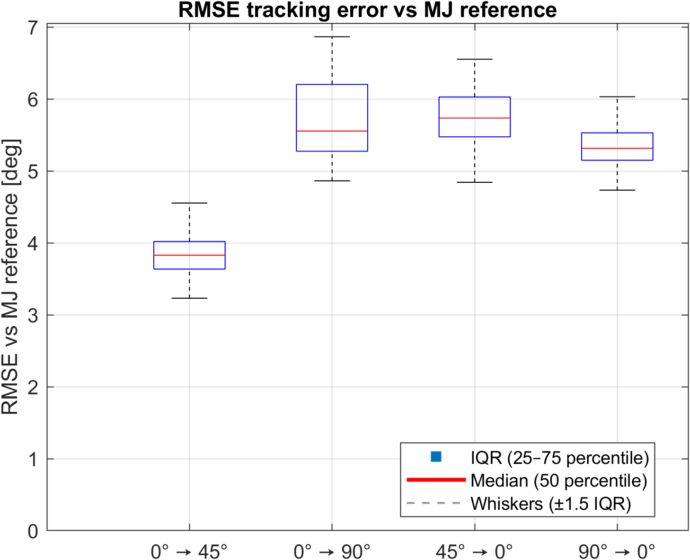

# Collaborative Robotics – Voice-Controlled Elbow Exoskeleton

Voice-controlled assistive elbow exoskeleton developed as part of a university project for the **Collaborative Robotics** course.

## Overview

The project focuses on the development of a fully assisted elbow exoskeleton controlled through vocal commands.

The system integrates:

* offline voice-command recognition using **Vosk**
* wireless **Python–Arduino** communication
* closed-loop elbow position control
* **minimum-jerk trajectory generation**
* position-feedback-based stall detection
* emergency motor detachment
* experimental validation and data analysis in **MATLAB**

Voice commands are associated with predefined elbow target positions. Once a valid command is recognized, the corresponding target is transmitted wirelessly to the exoskeleton controller, which generates and executes a smooth minimum-jerk trajectory while continuously monitoring the joint position for safety.

## System Architecture


The high-level speech interface runs in Python and converts recognized vocal commands into target positions. Commands are transmitted via Wi-Fi to the Arduino-based low-level controller, which handles trajectory generation, position control and safety monitoring.

## Control Strategy

The elbow is controlled over a working range of **0°–90°**.

Instead of directly commanding step changes in joint position, the controller generates a quintic minimum-jerk trajectory between the current and desired elbow positions. This produces smooth rest-to-rest movements with zero initial and final velocity and acceleration.

Joint position is continuously measured through the exoskeleton position sensor and used both for motion monitoring and safety.

A stuck-condition mechanism detects abnormal situations in which the commanded motion is not accompanied by sufficient measured joint displacement. When this condition persists, the servomotor is automatically detached.

## Voice Interface

Voice recognition is performed locally using **Vosk**.

The speech interface recognizes a predefined vocabulary corresponding to the available task commands and communicates with the Arduino controller over Wi-Fi.

The Vosk acoustic model is not included in this repository and must be downloaded separately.

## Experimental Results

### Trajectory Tracking



The measured elbow trajectories were compared with the analytical minimum-jerk reference to evaluate the behaviour of the physical system.

### Tracking Error



Tracking performance was evaluated across multiple trials and subjects, including the analysis of variability and confidence intervals.

### RMSE Analysis



The RMSE was evaluated for each trajectory to provide a compact quantitative measure of tracking performance.

For the complete experimental methodology, results and discussion, see the [project report](docs/project_report.pdf).

## Repository Structure

```text
voice-controlled-elbow-exoskeleton/
│
├── firmware/
│   ├── exoskeleton_control/
│   ├── calibration/
│   └── data_acquisition/
│
├── speech_interface/
│   └── voice_controller.py
│
├── matlab_analysis/
│   ├── data_acquisition.m
│   ├── trajectory_analysis.m
│   ├── group_trajectory_analysis.m
│   ├── statistical_comparison.m
│   └── hysteresis_analysis.m
│
├── docs/
│   ├── system_architecture.svg
│   ├── project_report.pdf
│   └── figures/
│
├── requirements.txt
└── README.md
```

## Requirements

### Python

* Python 3
* Vosk
* SpeechRecognition
* PyAudio

Install the Python dependencies with:

```bash
pip install -r requirements.txt
```

### Arduino

The firmware requires:

* WiFiNINA
* Servo

### MATLAB

MATLAB is required to reproduce the experimental data analysis and figures.

## Academic Context

Group project developed for the **Collaborative Robotics** course, Academic Year **2025–2026**.

## Contributions

This project was developed as part of a university group project.

**My contributions included:**

* Development of the **voice-control interface** in Python using Vosk for offline speech recognition and wireless communication with the Arduino controller.
* Development of the **experimental data-analysis pipeline in MATLAB**, including trajectory processing, tracking-error evaluation, RMSE analysis, inter-subject comparison, and hysteresis analysis.
* Generation and interpretation of the main **experimental validation plots and performance results** reported in the project.


See the complete [project report](docs/project_report.pdf) for the full project description and team work.
